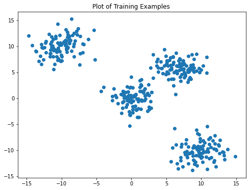

# k-means-clusters-scratch

For this code, we are implementing the k-means clustering algorithm on a set of
data containing 400 examples of renormalized gene expressions. In order to show the
algorithm’s properties, we will run it with different values for k clusters. We will also
run it multiple times with different randomized seedings at the beginning. In order to
see our results, we will compute the SSE of each K value for the clusters and determine
the best value k for the given data.

The data plotted.

Why do we need to run K-means algorithm multiple times with different initial random seedings?
.png)

The flaw in k-means is that k-means are sensitive to the initial seedings. Each initial seedling
will not guarantee unique clustering for each run and thus different choices in the seedings
will lead to different clustering results. This means if the initial random seeds are not close
to the optimal centroids in each cluster, the algorithm will end up developing sub-optimal
centroids like in Figure 3. While we know that one of the centroids should be located in the
red zone, we can assume that because the initial centroids were located in the green or purple
zone, it ends up converging at a local best solution instead of a global minimum.
To avoid this behavior, we run the algorithm with random seeds multiple times while keeping
the seed that minimizes our overall sum of squared errors.

